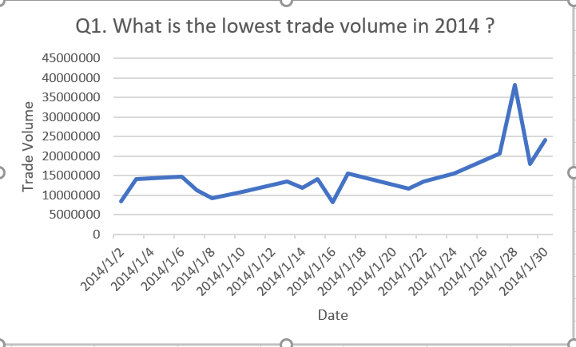
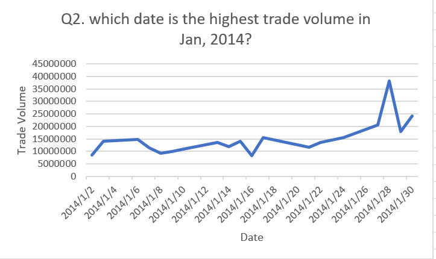
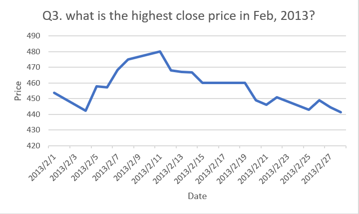

# datasets.aapl_historical_stock_price

This dataset shows the historical stock price till Janural, 2014. The date includes the lowest and highest price each day. And also record the opening and closing price each day. The total trade volume is also include.

Q1. What is the lowest trade volume in 2014 ?
```sql
SELECT date, 
volume
FROM datasets.aapl_historical_stock_price
where year = 2014
group by date, volume
order by volume ASC
```


Q2. which date is the highest trade volume in Jan, 2014? 
```sql
SELECT date,
Max(volume) AS Highest_Trade_Volume 
FROM datasets.aapl_historical_stock_price
where year = 2014
group by "date"
order by Highest_Trade_Volume DESC
```


Q3. what is the highest close price in Feb, 2013?
```sql
SELECT date,
Max(close) AS Highest_Close_Price
FROM datasets.aapl_historical_stock_price
where year = 2013 and date  BETWEEN '2013-02-01' and '2013-02-28'
group by "date"
order by Highest_Close_Price DESC
```


Q4. what is the average open price in June, 2013?
```sql
SELECT 
AVG(open) AS Average_Open_Price
FROM datasets.aapl_historical_stock_price
where year = 2013 and date  BETWEEN '2013-06-01' and '2013-06-30'
```

Q5. what is the total trade volum in August, 2013?
```sql
SELECT 
SUM(volume) AS Total_Trade_Volume
FROM datasets.aapl_historical_stock_price
where year = 2013 and date  BETWEEN '2013-08-01' and '2013-08-31'
```
